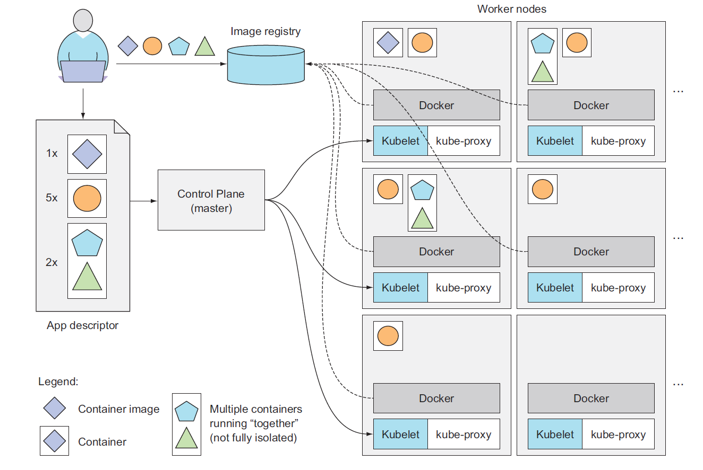
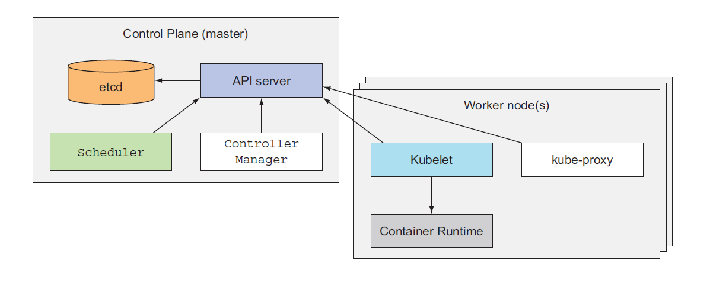
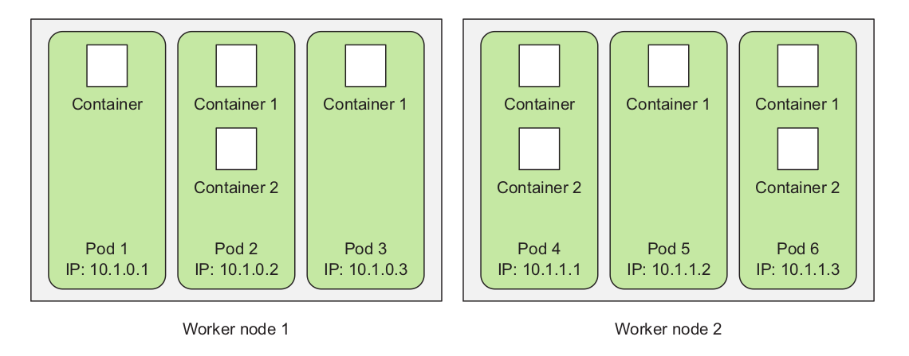
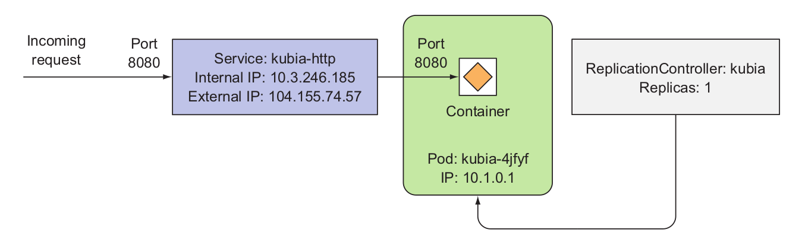
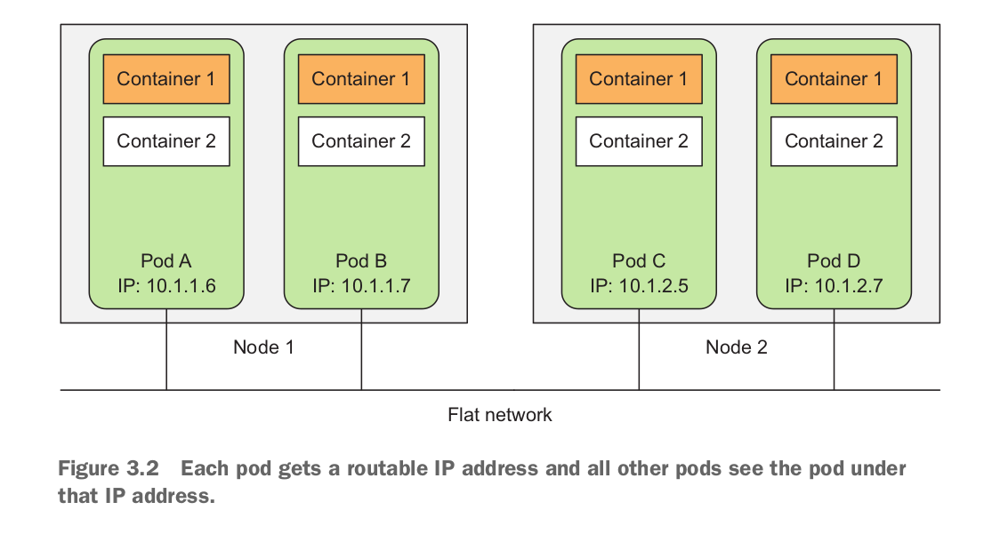
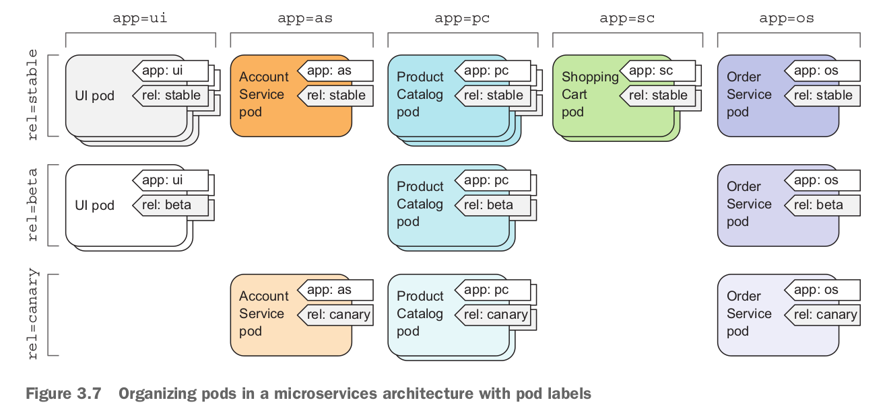

# Kubernetes

#### Kubernetes Resourses/Objects



#### Cluster

A cluster is a collection of nodes including other resources such as storage to run Kubernetes applications. A cluster has a single Kubernetes master node and zero or more worker nodes. A highly available cluster consists of multiple masters or master nodes.

#### Control Plane



The Control Plane is what controls the cluster and makes it function. It consists of multiple components that can run on a single master node or be split across multiple nodes and replicated to ensure high availability. These components are:

- The *Kubernetes API Server*, which you and the other Control Plane components communicate with
- The *Scheduler*, which schedules your apps (assigns a worker node to each deployable component of your application)
- The *Controller Manager*, which performs cluster-level functions, such as replicating components, keeping track of worker nodes, handling node failures, and so on
- *etcd*, a reliable distributed data store that persistently stores the cluster configuration.

#### Nodes

A node is a machine (physical or virtual) running Kubernetes onto which Pods may be scheduled. The node could be the **master node** or one of the **worker nodes** . The worker nodes are the machines that run your containerized applications. The task of running, monitoring, and providing services to your applications is done by the following components:

- Docker, rkt, or another container runtime, which runs your containers
- The Kubelet, which talks to the API server and manages containers on its node
- The Kubernetes Service Proxy (kube-proxy), which load-balances network traffic between application components

#### Pods

A pod is a group of one or more tightly related containers that will always run together on the same worker node and in the same Linux namespace(s). Each pod is like a separate logical machine with its own IP, hostname, processes, and so on, running a single application. The application can be a single process, running in a single container, or it can be a main application process and additional supporting
processes, each running in its own container. All the containers in a pod will appear to be running on the same logical machine, whereas containers in other pods, even if they’re running on the same worker node, will appear to be running on a different one.



A Pod is a collection of containers that are collocated and form an atomic unit. Multiple applications may be run within a Pod and though the different containers within a Pod could be for the same application, typically the different containers are for different applications. A Pod is a higher level abstraction for managing a group of containers with shared volumes and network namespace. All the applications (containers) in a Pod share the same filesystem and IP address with the port on which each application is exposed being different. Applications running in a Pod may access each other at “localhost”. Scheduling and replication are performed at the Pod level rather than at the individual container level. For example if a Pod defines two containers for different applications and replication level is set at 1, a single replica of the Pod consists of two containers, one each for the two applications. Pods facilitate resource sharing and communication what would otherwise be implemented using --link in individually running Docker containers. A Pod consisting of multiple containers would typically be used for tightly coupled applications. For example, if an nginx application makes use of MySQL database, the two applications are able to interact by Kubernetes running containers for each in the same Pod.


#### Services

A Service is the external interface for one or more Pods providing endpoint/s at which the application/s represented by the Service may be invoked. A Service is hosted at a single IP address but provides zero or more endpoints depending on the application/s interfaced by the Service. Services are connected to Pods using label selectors. Pods have label/s on them and a Service with a selector expression the same as a Pod label represents the Pod to an external client. **An external client does not know or need to know about the Pods represented by a Service. An external client only needs to know the name of the Service and the port at which a particular application is exposed.** The Service routes requests for an application based on a round- robin manner to one of the Pods selected using a label selector/. Thus, a Service is a high level abstraction for a collection of applications leaving the detail of which Pod to route a request to up to the Service. A Service could also be used for load balancing.



When a service is created, it gets a static IP, which never changes during the lifetime of the service. Instead of connecting to pods directly, clients should connect to the service through its constant IP address. The service makes sure one of the pods receives the connection, regardless of where the pod is currently running (and what its IP address is).

Services represent a static location for a group of one or more pods that all provide the same service. Requests coming to the IP and port of the service will be forwarded to the IP and port of one of the pods belonging to the service at that moment.

#### Network

All pods in a Kubernetes cluster reside in a single flat, shared, network-address space (shown in figure 3.2), which means every pod can access every other pod at the other pod’s IP address. No NAT (Network Address Translation) gateways exist between them. When two pods send network packets between each other, they’ll each see the actual IP address of the other as the source IP in the packet.




#### Label



A Label is a key-value pair identifying a resource such as a Pod, Service, or Replication Controller: most commonly a Pod. Labels are used to identify a group or subset of resources for tasks such as assigning them to a Service. Services use label selectors to select the Pods they manage. For example, if a Pod is labeled “app = pc” and a Service “selector” is set as “app = pc” the Pod is represented by the Service. Service selectors are based on labels and not on the type of application they manage. For example, a Service could be representing a Pod running a hello-world application container with a specific label. Another Pod also running a hello-world container but with a label different than the Service selector expression would not be represented by the Service. And a third Pod running an application that is not a hello-world application but has the same label as the Service selector would also be represented by the same Service.

#### Selector

A selector is a key-value expression to identify resources using matching labels. As discussed in the preceding subsection a Service selector expression “app = helloApp” would select all Pods with the label “app = helloApp”. While typically a Service defines a selector to select Pods a Service could be defined to not include a selector and be defined to abstract other kinds of back ends. Two kinds of selectors are supported: equality-based and set-based. A selector could be made of multiple requirements implying that multiple expressions (equality-based or set-based) separated by ',' could be specified. All of the requirements must be met by a matching resource such as a Pod for the resource to be selected. A resource such as a Pod could have additional labels, but the ones in the selector must be specified for the resource to be selected. The equality-based selector, which is more commonly used and also the one used in the book, supports =,!=,== operators, the = being synonymous to ==.

#### Namespaces

A namespace is a level above the name to demarcate a group of resources for a project or team to prevent name collisions. Resources within different namespaces could have the same name, but resources within a namespace have different names.

Although namespaces allow you to isolate objects into distinct groups, which allows you to operate only on those belonging to the speci- fied namespace, they don’t provide any kind of isolation of running objects.

#### ReplicaSets

A ReplicaSet is defined with fields, including a selector that specifies how to identify Pods it can acquire, a number of replicas indicating how many Pods it should be maintaining, and a pod template specifying the data of new Pods it should create to meet the number of replicas criteria. A ReplicaSet then fulfills its purpose by creating and deleting Pods as needed to reach the desired number. When a ReplicaSet needs to create new Pods, it uses its Pod template.

A ReplicaSet ensures that a specified number of pod replicas are running at any given time. However, a Deployment is a higher-level concept that manages ReplicaSets and provides declarative updates to Pods along with a lot of other useful features. Therefore, we recommend using Deployments instead of directly using ReplicaSets, unless you require custom update orchestration or don’t require updates at all.

```
apiVersion: apps/v1
kind: ReplicaSet
metadata:
  name: simple_webserver_replicaset
  labels:
    release: stable
spec:
  replicas: 3
  selector:    
    matchLabels:
      run: simple-webserver
  template:
    metadata:
      labels:
        run: frontend
    spec:
      containers:
        - name: simple-webserver-manual
          image: ilkayaktas/simple_webserver:latest
          ports:
            - containerPort: 8088
              protocol: TCP

```

When you post the file to the API server, Kubernetes creates a new ReplicaSet named simple_webserver_replicaset, which makes sure three pod instances always match the label selector run=simple-webserver. **When there aren’t enough pods, new pods will be created from the provided pod template**. The contents of the template are almost identical to the pod definition you created.

The pod labels in the template must obviously match the label selector of the ReplicaSet; otherwise the controller would create new pods indefinitely, because spinning up a new pod wouldn’t bring the actual replica count any closer to the desired number of replicas. 

The main improvements of ReplicaSets over ReplicationControllers are their more expressive label selectors. 

#### Liveness Probe

For pods running in production, you should always define a liveness probe. Without one, Kubernetes has no way of knowing whether your app is still alive or not. As long as the process is still running, Kubernetes will consider the container to be healthy.

Be sure to check only the internals of the app and nothing influenced by an external factor. For example, a frontend web server’s liveness probe shouldn’t return a failure when the server can’t connect to the backend database. If the underlying cause is in the database itself, restarting the web server container will not fix the problem.

Liveness probes shouldn’t use too many computational resources and shouldn’t take too long to complete. By default, the probes are executed relatively often and are only allowed one second to complete. 

**httpGet**: The probe is considered successful if response code is 2xx or 3xx.

```yaml
spec:
  containers:
    - name: simple_webserver_unhealthy
      image: ilkayaktas/simple_webserver_unhealthy:latest
      ports:
        - containerPort: 8088
          protocol: TCP
      livenessProbe:     # A liveness probe that will perform an HTTP GET
        httpGet:				 #  
          path: /        # The path to request in the HTTP request
          port: 8088     # The network port the probe should connect to
        initialDelaySeconds: 15
        periodSeconds: 20          
```

 **tcpSocket**: The probe is considered successful if open a TCP connection to the specified port of the container.

```yaml
 livenessProbe:     # A liveness probe that will perform an tcp socket connection
    tcpSocket:				 
      port: 8088     
    initialDelaySeconds: 15
    periodSeconds: 20
```

**exec:** The probe is considered successful if executes an arbitrary command inside the container and checks the command’s exit status code. If the status code is 0.

```yaml
  livenessProbe:     # A liveness probe that will perform an exec
    exec:				     
      command:
      - cat
      - /tmp/healthy
      
```


#### DaemonSets

In certain cases exist when you want a pod to run on each and every node in the cluster and each node needs to run exactly one instance of the pod. Those cases include infrastructure-related pods that perform system-level operations. For example, you’ll want to run a log collector and a resource monitor on every node. Another good example is Kubernetes’ own kube-proxy process, which needs to run on all nodes to make services work. 

It's job is to ensure that a pod matchingg its pod selector is running on each node.

Running a cluster storage daemon, such as `glusterd`, `ceph`, on each node.

Running a logs collection daemon on every node, such as `fluentd` or `filebeat`.

Running a node monitoring daemon on every node, such as [Prometheus Node Exporter](https://github.com/prometheus/node_exporter), [Flowmill](https://github.com/Flowmill/flowmill-k8s/), [Sysdig Agent](https://docs.sysdig.com/), `collectd`, [Dynatrace OneAgent](https://www.dynatrace.com/technologies/kubernetes-monitoring/), [AppDynamics Agent](https://docs.appdynamics.com/display/CLOUD/Container+Visibility+with+Kubernetes), [Datadog agent](https://docs.datadoghq.com/agent/kubernetes/daemonset_setup/), [New Relic agent](https://docs.newrelic.com/docs/integrations/kubernetes-integration/installation/kubernetes-installation-configuration), Ganglia `gmond`, [Instana Agent](https://www.instana.com/supported-integrations/kubernetes-monitoring/) or [Elastic Metricbeat](https://www.elastic.co/guide/en/beats/metricbeat/current/running-on-kubernetes.html).

**Deployments**


**Events**

**ServiceAccounts**


**Roles**

**Secrets**

**ConfigMaps**

**Ingress**

**PersistentVolume**

**PersistentVolumeClaim**


Container teknolojisi uygulamaları tüm çalışma ortamları ile birlikte (çalışması için gereken tüm dosyalarla birlikte) izole bir paket yapısına çevirmeye izin vermektedir. Bu sayede uygulamamızı farklı ortamlara (test, deployment, farklı işletim sistemleri) taşıma konusunda kolaylık sağlanmaktadır.

KUBERNETES ARCHİTECTURE PHOTO


Minikube, Kubernetes'in local olarak çalışmasını sağlayan basit bir araçtır. Single Node Application kurulabilir. Geliştirme ve test amaçlıdır. Deployment için kullanılmamasına dair bir çok yerde tavsiyeler, dikteler vardır.


##### kubectl CLI

kubectl	[command]	[TYPE]	[NAME]	[flags]

Command: Gerçekleştirmek istenen komuttur.

Type: Kubernetes Resource tipini ifade eder.

Name: Resource ismini ifade eder.


kubectl run pod_name --image=ilkayaktas/mydockerimage

Bu komut ile ilkayaktas/mydockerimage imajı dockerhub'dan indirilir ve pod_name ismi ile deploy edilir. kubectl get pods ile durumuna bakıldığında status önce Pending olarak görünür. Bu imajı indirme aşamasında olduğu anlamına gelir. Daha sonra status Running olarak güncellenir.