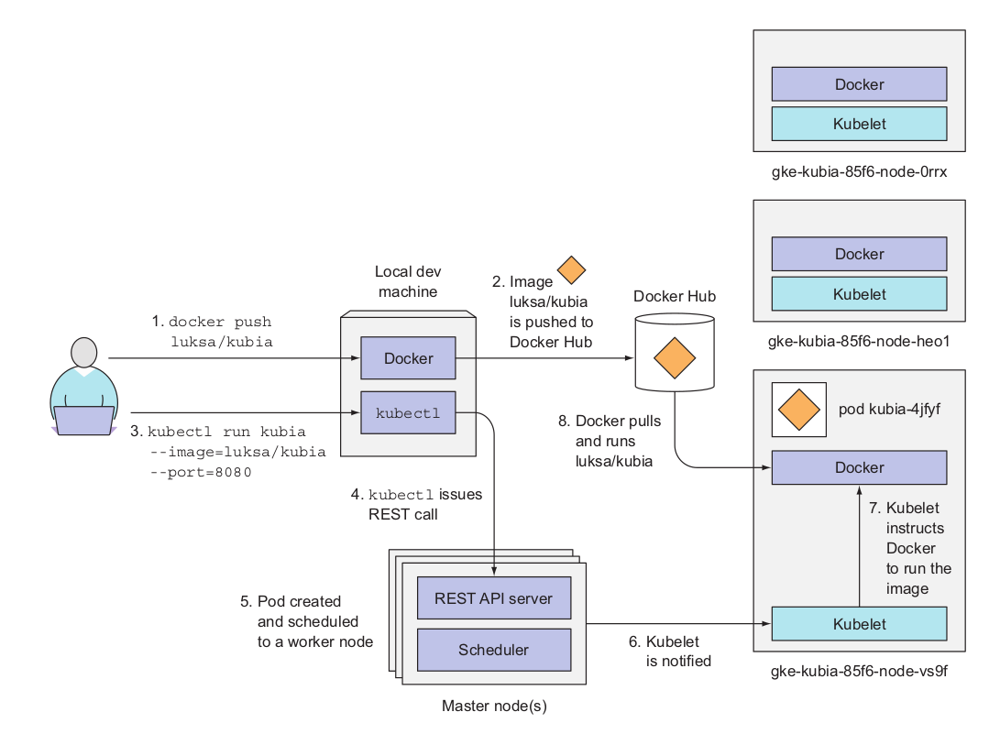
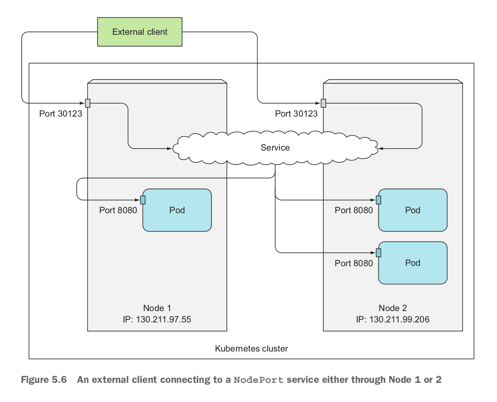

# Kubernetes

#### Kubernetes Resourses/Objects


#### Cluster

A cluster is a collection of nodes including other resources such as storage to run Kubernetes applications. A cluster has a single Kubernetes master node and zero or more worker nodes. A highly available cluster consists of multiple masters or master nodes.

#### Control Plane


The Control Plane is what controls the cluster and makes it function. It consists of multiple components that can run on a single master node or be split across multiple nodes and replicated to ensure high availability. These components are:

- The *Kubernetes API Server*, which you and the other Control Plane components communicate with
- The *Scheduler*, which schedules your apps (assigns a worker node to each deployable component of your application)
- The *Controller Manager*, which performs cluster-level functions, such as replicating components, keeping track of worker nodes, handling node failures, and so on
- *etcd*, a reliable distributed data store that persistently stores the cluster configuration.

#### Nodes

A node is a machine (physical or virtual) running Kubernetes onto which Pods may be scheduled. The node could be the **master node** or one of the **worker nodes** . The worker nodes are the machines that run your containerized applications. The task of running, monitoring, and providing services to your applications is done by the following components:

- Docker, rkt, or another container runtime, which runs your containers
- The Kubelet, which talks to the API server and manages containers on its node
- The Kubernetes Service Proxy (kube-proxy), which load-balances network traffic between application components

#### Pods

A pod is a group of one or more tightly related containers that will always run together on the same worker node and in the same Linux namespace(s). Each pod is like a separate logical machine with its own IP, hostname, processes, and so on, running a single application. The application can be a single process, running in a single container, or it can be a main application process and additional supporting
processes, each running in its own container. All the containers in a pod will appear to be running on the same logical machine, whereas containers in other pods, even if they’re running on the same worker node, will appear to be running on a different one.


A Pod is a collection of containers that are collocated and form an atomic unit. Multiple applications may be run within a Pod and though the different containers within a Pod could be for the same application, typically the different containers are for different applications. A Pod is a higher level abstraction for managing a group of containers with shared volumes and network namespace. All the applications (containers) in a Pod share the same filesystem and IP address with the port on which each application is exposed being different. Applications running in a Pod may access each other at “localhost”. Scheduling and replication are performed at the Pod level rather than at the individual container level. For example if a Pod defines two containers for different applications and replication level is set at 1, a single replica of the Pod consists of two containers, one each for the two applications. Pods facilitate resource sharing and communication what would otherwise be implemented using --link in individually running Docker containers. A Pod consisting of multiple containers would typically be used for tightly coupled applications. For example, if an nginx application makes use of MySQL database, the two applications are able to interact by Kubernetes running containers for each in the same Pod.




#### Services

A Service is the external interface for one or more Pods providing endpoint/s at which the application/s represented by the Service may be invoked. **The primary purpose of services is exposing groups of pods to other pods in the cluster, but you’ll usually also want to expose services externally.** A Service is hosted at a single IP address but provides zero or more endpoints depending on the application/s interfaced by the Service. Services are connected to Pods using label selectors. Pods have label/s on them and a Service with a selector expression the same as a Pod label represents the Pod to an external client. **An external client does not know or need to know about the Pods represented by a Service. An external client only needs to know the name of the Service and the port at which a particular application is exposed.** The Service routes requests for an application based on a round- robin manner to one of the Pods selected using a label selector/. Thus, a Service is a high level abstraction for a collection of applications leaving the detail of which Pod to route a request to up to the Service. A Service could also be used for load balancing.


When a service is created, it gets a static IP, which never changes during the lifetime of the service. Instead of connecting to pods directly, clients should connect to the service through its constant IP address. The service makes sure one of the pods receives the connection, regardless of where the pod is currently running (and what its IP address is).

Services represent a static location for a group of one or more pods that all provide the same service. Requests coming to the IP and port of the service will be forwarded to the IP and port of one of the pods belonging to the service at that moment.

**While defining service in yaml file, spec.selector is important because all pods with selector labels will be part of this service.**

```apiVersion: v1
kind: Service
metadata:
  name: iaktas-service
  namespace: iaktas
  labels:
     app: iaktas
spec:
  ports:
     - port: 80
       targetPort: 8088
  selector: # All pods with the app=iaktas-rs label will be part of this service.
     app: iaktas-rs
```


#### Service Discovery

Each service information is located under pod environment variable. If pods are created before service, you should kill pods and restart again.

``` 
kubectl exec iaktas-replicaset-t6xgs env

PATH=/usr/local/sbin:/usr/local/bin:/usr/sbin:/usr/bin:/sbin:/bin
HOSTNAME=iaktas-replicaset-t6xgs
IAKTAS_SERVICE_PORT_80_TCP_PROTO=tcp
KUBERNETES_SERVICE_HOST=10.233.0.1   // Kubernetes service
KUBERNETES_PORT_443_TCP_PROTO=tcp
KUBERNETES_PORT_443_TCP_PORT=443
IAKTAS_SERVICE_PORT_80_TCP_ADDR=10.233.30.112
KUBERNETES_SERVICE_PORT=443
KUBERNETES_SERVICE_PORT_HTTPS=443
IAKTAS_SERVICE_SERVICE_HOST=10.233.30.112    // iaktas_service
IAKTAS_SERVICE_PORT=tcp://10.233.30.112:80
KUBERNETES_PORT_443_TCP_ADDR=10.233.0.1
IAKTAS_SERVICE_SERVICE_PORT=80
IAKTAS_SERVICE_PORT_80_TCP=tcp://10.233.30.112:80
IAKTAS_SERVICE_PORT_80_TCP_PORT=80
KUBERNETES_PORT=tcp://10.233.0.1:443
KUBERNETES_PORT_443_TCP=tcp://10.233.0.1:443
NODE_VERSION=14.5.0
YARN_VERSION=1.22.4
HOME=/root
```

Dashes in the service name are converted to underscores and all letters are uppercased when the service name is used as the prefix in the environment variable’s name.

#### Service Endpoints

An Endpoints resource (yes, plural) is a list of IP addresses and ports exposing a service. When a client connects to a service, the service proxy selects one of those IP and port pairs and redirects the incoming connection to the server listening at that location. **Regular service type is ClusterIP. There are also NodePort, LoadBalancer and Ingress available**

```
kubectl describe svc iaktas-service -n iaktas

Name:              iaktas-service
Namespace:         iaktas
Labels:            app=iaktas
Annotations:       kubectl.kubernetes.io/last-applied-configuration:
                     {"apiVersion":"v1","kind":"Service","metadata":{"annotations":{},"labels":{"app":"iaktas"},"name":"iaktas-service","namespace":"iaktas"},"...
Selector:          app=iaktas-rs
Type:              ClusterIP
IP:                10.233.30.112
Port:              <unset>  80/TCP
TargetPort:        8088/TCP
Endpoints:         10.233.69.61:8088,10.233.69.62:8088,10.233.73.30:8088 	// These are endpoints
Session Affinity:  None
Events:            <none>

```

```
kubectl get endpoints -n iaktas

NAME             ENDPOINTS                                               AGE
iaktas-service   10.233.69.61:8088,10.233.69.62:8088,10.233.73.30:8088   76m

```

If you create a service without a pod selector, Kubernetes won’t even create the Endpoints resource (after all, without a selector, it can’t know which pods to include in the service).

#### NodePort

By creating a NodePort service, you make Kubernetes reserve a port on all its nodes (the same port number is used across all of them) and forward incoming connections to the pods that are part of the service.

This is similar to a regular service (their actual type is ClusterIP ), but a NodePort service can be accessed not only through the service’s internal cluster IP, but also through any node’s IP and the reserved node port.



#### LoadBalancer

The load balancer will have its own unique, publicly accessible IP address and will redirect all connections to your service. You can thus access your service through the load balancer’s IP address.


#### Network

All pods in a Kubernetes cluster reside in a single flat, shared, network-address space (shown in figure 3.2), which means every pod can access every other pod at the other pod’s IP address. No NAT (Network Address Translation) gateways exist between them. When two pods send network packets between each other, they’ll each see the actual IP address of the other as the source IP in the packet.


#### Label


A Label is a key-value pair identifying a resource such as a Pod, Service, or Replication Controller: most commonly a Pod. Labels are used to identify a group or subset of resources for tasks such as assigning them to a Service. Services use label selectors to select the Pods they manage. For example, if a Pod is labeled “app = pc” and a Service “selector” is set as “app = pc” the Pod is represented by the Service. Service selectors are based on labels and not on the type of application they manage. For example, a Service could be representing a Pod running a hello-world application container with a specific label. Another Pod also running a hello-world container but with a label different than the Service selector expression would not be represented by the Service. And a third Pod running an application that is not a hello-world application but has the same label as the Service selector would also be represented by the same Service.

#### Selector

A selector is a key-value expression to identify resources using matching labels. As discussed in the preceding subsection a Service selector expression “app = helloApp” would select all Pods with the label “app = helloApp”. While typically a Service defines a selector to select Pods a Service could be defined to not include a selector and be defined to abstract other kinds of back ends. Two kinds of selectors are supported: equality-based and set-based. A selector could be made of multiple requirements implying that multiple expressions (equality-based or set-based) separated by ',' could be specified. All of the requirements must be met by a matching resource such as a Pod for the resource to be selected. A resource such as a Pod could have additional labels, but the ones in the selector must be specified for the resource to be selected. The equality-based selector, which is more commonly used and also the one used in the book, supports =,!=,== operators, the = being synonymous to ==.

#### Namespaces

A namespace is a level above the name to demarcate a group of resources for a project or team to prevent name collisions. Resources within different namespaces could have the same name, but resources within a namespace have different names.

Although namespaces allow you to isolate objects into distinct groups, which allows you to operate only on those belonging to the speci- fied namespace, they don’t provide any kind of isolation of running objects.

#### ReplicaSets

A ReplicaSet is defined with fields, including a selector that specifies how to identify Pods it can acquire, a number of replicas indicating how many Pods it should be maintaining, and a pod template specifying the data of new Pods it should create to meet the number of replicas criteria. A ReplicaSet then fulfills its purpose by creating and deleting Pods as needed to reach the desired number. When a ReplicaSet needs to create new Pods, it uses its Pod template.

A ReplicaSet ensures that a specified number of pod replicas are running at any given time. However, a Deployment is a higher-level concept that manages ReplicaSets and provides declarative updates to Pods along with a lot of other useful features. Therefore, we recommend using Deployments instead of directly using ReplicaSets, unless you require custom update orchestration or don’t require updates at all.

```
apiVersion: apps/v1
kind: ReplicaSet
metadata:
  name: simple_webserver_replicaset
  labels:
    release: stable
spec:
  replicas: 3
  selector:    
    matchLabels:
      run: simple-webserver
  template:
    metadata:
      labels:
        run: frontend
    spec:
      containers:
        - name: simple-webserver-manual
          image: ilkayaktas/simple_webserver:latest
          ports:
            - containerPort: 8088
              protocol: TCP

```

When you post the file to the API server, Kubernetes creates a new ReplicaSet named simple_webserver_replicaset, which makes sure three pod instances always match the label selector run=simple-webserver. **When there aren’t enough pods, new pods will be created from the provided pod template**. The contents of the template are almost identical to the pod definition you created.

The pod labels in the template must obviously match the label selector of the ReplicaSet; otherwise the controller would create new pods indefinitely, because spinning up a new pod wouldn’t bring the actual replica count any closer to the desired number of replicas. 

The main improvements of ReplicaSets over ReplicationControllers are their more expressive label selectors. 

#### Liveness Probe

For pods running in production, you should always define a liveness probe. Without one, Kubernetes has no way of knowing whether your app is still alive or not. As long as the process is still running, Kubernetes will consider the container to be healthy.

Be sure to check only the internals of the app and nothing influenced by an external factor. For example, a frontend web server’s liveness probe shouldn’t return a failure when the server can’t connect to the backend database. If the underlying cause is in the database itself, restarting the web server container will not fix the problem.

Liveness probes shouldn’t use too many computational resources and shouldn’t take too long to complete. By default, the probes are executed relatively often and are only allowed one second to complete. 

**httpGet**: The probe is considered successful if response code is 2xx or 3xx.

```yaml
spec:
  containers:
    - name: simple_webserver_unhealthy
      image: ilkayaktas/simple_webserver_unhealthy:latest
      ports:
        - containerPort: 8088
          protocol: TCP
      livenessProbe:     # A liveness probe that will perform an HTTP GET
        httpGet:				 #  
          path: /        # The path to request in the HTTP request
          port: 8088     # The network port the probe should connect to
        initialDelaySeconds: 15
        periodSeconds: 20          
```

 **tcpSocket**: The probe is considered successful if open a TCP connection to the specified port of the container.

```yaml
 livenessProbe:     # A liveness probe that will perform an tcp socket connection
    tcpSocket:				 
      port: 8088     
    initialDelaySeconds: 15
    periodSeconds: 20
```

**exec:** The probe is considered successful if executes an arbitrary command inside the container and checks the command’s exit status code. If the status code is 0.

```yaml
  livenessProbe:     # A liveness probe that will perform an exec
    exec:				     
      command:
      - cat
      - /tmp/healthy
      
```


#### Readyness Probe

Sometimes, applications are temporarily unable to serve traffic. For example, an application might need to load large data or configuration files during startup, or depend on external services after startup. In such cases, you don’t want to kill the application, but you don’t want to send it requests either. Kubernetes provides readiness probes to detect and mitigate these situations. A pod with containers reporting that they are not ready does not receive traffic through Kubernetes Services. Readiness probes runs on the container during its whole lifecycle.

```yaml
readinessProbe:
  exec:
    command:
    - cat
    - /tmp/healthy
  initialDelaySeconds: 5
  periodSeconds: 5
```

**Configuration for HTTP and TCP readiness probes also remains identical to liveness probes.**

Readiness and liveness probes can be used in parallel for the same container. Using both can ensure that traffic does not reach a container that is not ready for it, and that containers are restarted when they fail.

#### DaemonSets

In certain cases exist when you want a pod to run on each and every node in the cluster and each node needs to run exactly one instance of the pod. Those cases include infrastructure-related pods that perform system-level operations. For example, you’ll want to run a log collector and a resource monitor on every node. Another good example is Kubernetes’ own kube-proxy process, which needs to run on all nodes to make services work. 

It's job is to ensure that a pod matchingg its pod selector is running on each node.

Running a cluster storage daemon, such as `glusterd`, `ceph`, on each node.

Running a logs collection daemon on every node, such as `fluentd` or `filebeat`.

Running a node monitoring daemon on every node, such as [Prometheus Node Exporter](https://github.com/prometheus/node_exporter), [Flowmill](https://github.com/Flowmill/flowmill-k8s/), [Sysdig Agent](https://docs.sysdig.com/), `collectd`, [Dynatrace OneAgent](https://www.dynatrace.com/technologies/kubernetes-monitoring/), [AppDynamics Agent](https://docs.appdynamics.com/display/CLOUD/Container+Visibility+with+Kubernetes), [Datadog agent](https://docs.datadoghq.com/agent/kubernetes/daemonset_setup/), [New Relic agent](https://docs.newrelic.com/docs/integrations/kubernetes-integration/installation/kubernetes-installation-configuration), Ganglia `gmond`, [Instana Agent](https://www.instana.com/supported-integrations/kubernetes-monitoring/) or [Elastic Metricbeat](https://www.elastic.co/guide/en/beats/metricbeat/current/running-on-kubernetes.html).

#### Job - CronJob

A Job creates one or more Pods and ensures that a specified number of them successfully terminate. As pods successfully complete, the Job tracks the successful completions. When a specified number of successful completions is reached, the task (ie, Job) is complete. Deleting a Job will clean up the Pods it created.

A simple case is to create one Job object in order to reliably run one Pod to completion. The Job object will start a new Pod if the first Pod fails or is deleted (for example due to a node hardware failure or a node reboot).

In the event of a node failure, the pods on that node that are managed by a Job will be rescheduled to other nodes the way ReplicaSet pods are. In the event of a failure of the process itself (when the process returns an error exit code), the Job can be config- ured to either restart the container or not.

**Bare Pods**

When the node that a Pod is running on reboots or fails, the pod is terminated and will not be restarted. However, a Job will create new Pods to replace terminated ones. For this reason, we recommend that you use a Job rather than a bare Pod, even if your application requires only a single Pod.

A *CronJob* creates Jobs on a repeating schedule. One CronJob object is like one line of a *crontab* (cron table) file. It runs a job periodically on a given schedule, written in [Cron](https://en.wikipedia.org/wiki/Cron) format.


#### Garbage Collection 

Some Kubernetes objects are owners of other objects. For example, a ReplicaSet is the owner of a set of Pods. The owned objects are called *dependents* of the owner object. Every dependent object has a `metadata.ownerReferences` field that points to the owning object.

When you delete an object, you can specify whether the object’s dependents are also deleted automatically. Deleting dependents automatically is called *cascading deletion*. There are two modes of *cascading deletion*: *background* and *foreground*.

If you delete an object without deleting its dependents automatically, the dependents are said to be *orphaned*.


#### Deployments

A *Deployment* provides declarative updates for Pods and ReplicaSets. You describe a desired state in a Deployment, and the Deployment Controller changes the actual state to the desired state at a controlled rate. You can define Deployments to create new ReplicaSets, or to remove existing Deployments and adopt all their resources with new Deployments.

**Rolling Update**

Instead of bringing up all the new pods and deleting the old pods at once, you can also perform a rolling update, which replaces pods step by step. You do this by slowly scaling down the previous ReplicationController and scaling up the new one. In this case, you’ll want the Service’s pod selector to include both the old and the new pods, so it directs requests toward both sets of pods. 


Doing a rolling update manually is laborious and error-prone. Depending on the number of replicas, you’d need to run a dozen or more commands in the proper order to perform the update process. Luckily, Kubernetes allows you to perform the rolling update with a single command.

The only thing you need to do is modify the pod template defined in the Deployment resource and Kubernetes will take all the steps necessary to get the actual system state to what’s defined in the resource. Similar to scaling a ReplicationController or ReplicaSet up or down, all you need to do is reference a new image tag in the Deployment’s pod tem- plate and leave it to Kubernetes to transform your system so it matches the new desired state.

**Pod-template-hash label**

The `pod-template-hash` label is added by the Deployment controller to every ReplicaSet that a Deployment creates or adopts.

This label ensures that child ReplicaSets of a Deployment do not overlap. It is generated by hashing the `PodTemplate` of the ReplicaSet and using the resulting hash as the label value that is added to the ReplicaSet selector, Pod template labels, and in any existing Pods that the ReplicaSet might have.

**Deployment Strategies**

RollingUpdate and Recreate.The default strategy is to perform a rolling update (the strategy is called RollingUpdate). The alternative is the Recreate strategy, which deletes all the old pods at once and then creates new ones, similar to modifying a ReplicationController’s pod template and then deleting all the pods 

The `Recreate strategy` causes all old pods to be deleted before the new ones are created. Use this strategy when your application doesn’t support running multiple ver- sions in parallel and requires the old version to be stopped completely before the new one is started. This strategy does involve a short period of time when your app becomes completely unavailable.

The `RollingUpdate strategy`, on the other hand, removes old pods one by one, while adding new ones at the same time, keeping the application available throughout the whole process, and ensuring there’s no drop in its capacity to handle requests. This is the default strategy. The upper and lower limits for the number of pods above or below the desired replica count are configurable. You should use this strategy only when your app can handle running both the old and new version at the same time.

**Rate of Rollout**

Deployment ensures that only a certain number of Pods are down while they are being updated. By default, it ensures that at least 75% of the desired number of Pods are up (25% max unavailable).

Deployment also ensures that only a certain number of Pods are created above the desired number of Pods. By default, it ensures that at most 125% of the desired number of Pods are up (25% max surge).

Two properties affect how many pods are replaced at once during a Deployment’s roll- ing update. They are maxSurge and maxUnavailable and can be set as part of the rollingUpdate sub-property of the Deployment’s strategy attribute, as shown in the following listing.

```yaml
spec:
          strategy:
            rollingUpdate:
              maxSurge: 1
              maxUnavailable: 0
            type: RollingUpdate
```

**maxSurge**: Determines how many pod instances you allow to exist above the desired replica count configured on the Deployment. It defaults to 25%, so there can be at most 25% more pod instances than the desired count. If the desired replica count is set to four, there will never be more than five pod instances running at the same time during an update. When converting a percentage to an absolute number, the number is rounded up. Instead of a percentage, the value can also be an absolute value (for example, one or two additional pods can be allowed).

**maxUnavailable**: Determines how many pod instances can be unavailable relative to the desired replica count during the update. It also defaults to 25%, so the number of avail- able pod instances must never fall below 75% of the desired replica count. Here, when converting a percentage to an absolute number, the number is rounded down. If the desired replica count is set to four and the percentage is 25%, only one pod can be unavailable. There will always be at least three pod instances available to serve requests during the whole rollout. As with maxSurge, you can also specify an absolute value instead of a percentage.

**minReadySeconds**: You used it to slow down the rollout, so you could see it was indeed performing a rolling update and not replacing all the pods at once. The main function of minReadySeconds is to prevent deploying malfunctioning versions, not slowing down a deployment for fun. 

The minReadySeconds property specifies how long a newly created pod should be ready before the pod is treated as available. Until the pod is available, the rollout pro- cess will not continue (remember the maxUnavailable property?). A pod is ready when readiness probes of all its containers return a success. If a new pod isn’t func- tioning properly and its readiness probe starts failing before minReadySeconds have passed, the rollout of the new version will effectively be blocked.

**progressDeadlineSeconds**: Your Deployment may get stuck trying to deploy its newest ReplicaSet without ever completing. One way you can detect this condition is to specify a deadline parameter in your Deployment spec: (.spec.progressDeadlineSeconds). `.spec.progressDeadlineSeconds` denotes the number of seconds the Deployment controller waits before indicating (in the Deployment status) that the Deployment progress has stalled. Once the deadline has been exceeded, the Deployment controller adds a DeploymentCondition with the following attributes to the Deployment’s `.status.conditions`:

- Type=Progressing
- Status=False
- Reason=ProgressDeadlineExceeded

**revisionHistoryLimit**: You can set `.spec.revisionHistoryLimit` field in a Deployment to specify how many old ReplicaSets for this Deployment you want to retain. The rest will be garbage-collected in the background. By default, it is 10. Explicitly setting this field to 0, will result in cleaning up all the history of your Deployment thus that Deployment will not be able to roll back.

#### Modifying Resources


**Events**

**ServiceAccounts**


**Roles**

**Secrets**

**ConfigMaps**

**Ingress**

**PersistentVolume**

**PersistentVolumeClaim**


Container teknolojisi uygulamaları tüm çalışma ortamları ile birlikte (çalışması için gereken tüm dosyalarla birlikte) izole bir paket yapısına çevirmeye izin vermektedir. Bu sayede uygulamamızı farklı ortamlara (test, deployment, farklı işletim sistemleri) taşıma konusunda kolaylık sağlanmaktadır.

KUBERNETES ARCHİTECTURE PHOTO


Minikube, Kubernetes'in local olarak çalışmasını sağlayan basit bir araçtır. Single Node Application kurulabilir. Geliştirme ve test amaçlıdır. Deployment için kullanılmamasına dair bir çok yerde tavsiyeler, dikteler vardır.


##### kubectl CLI

kubectl	[command]	[TYPE]	[NAME]	[flags]

Command: Gerçekleştirmek istenen komuttur.

Type: Kubernetes Resource tipini ifade eder.

Name: Resource ismini ifade eder.


kubectl run pod_name --image=ilkayaktas/mydockerimage

Bu komut ile ilkayaktas/mydockerimage imajı dockerhub'dan indirilir ve pod_name ismi ile deploy edilir. kubectl get pods ile durumuna bakıldığında status önce Pending olarak görünür. Bu imajı indirme aşamasında olduğu anlamına gelir. Daha sonra status Running olarak güncellenir.